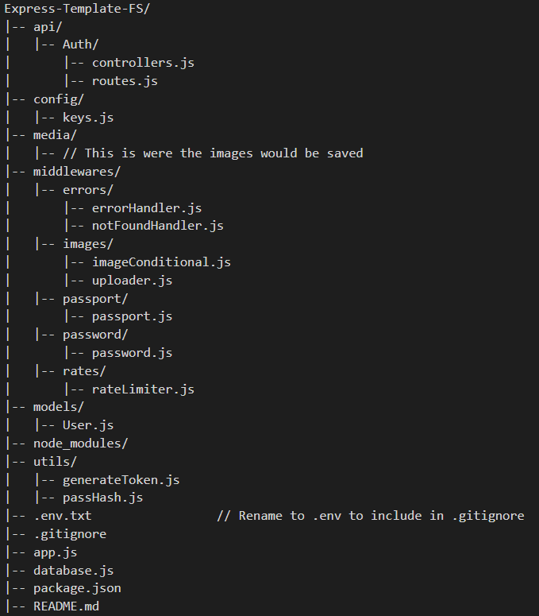

# Express-Template-FS

In this template, you have all the necessary apis, models, middlewares, and files for a functional user authentication application that connects to your MongoDB.

Simply fork this repo and you will be able to choose it as a Github template for any new repos you create.

You will have to use `npm install` to install node modules.
`npm install nodemon -g` This step is necessary to install this package globally. This package restarts the node.js application everytime you save.

## File Structure



### .env

```javascript
PORT = 8000;
JWT_SECRET = "secret";
JWT_TOKEN_EXP = "1h";
MONGO_DB_URL = "YOUR MONGODB URL";
```

### .gitignore

```javascript
.env
node_modules
media
```
